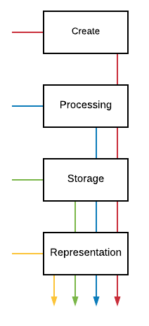
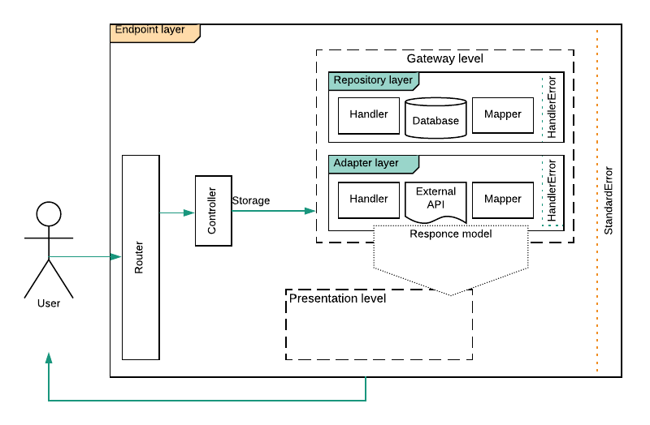
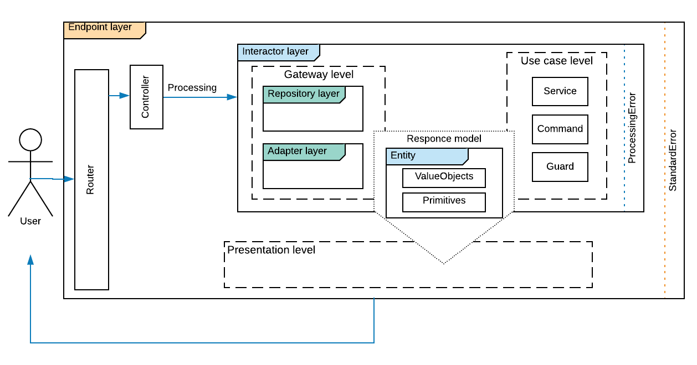
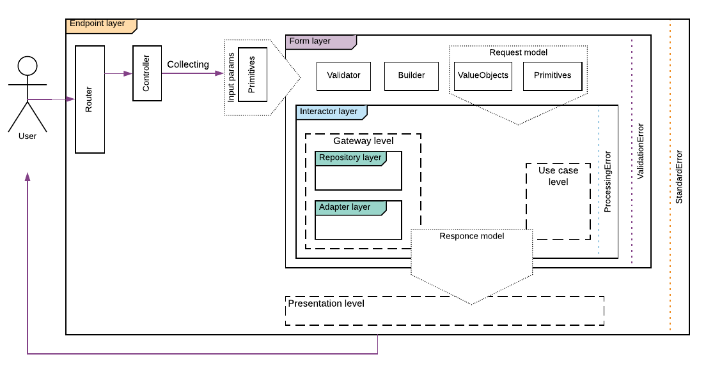
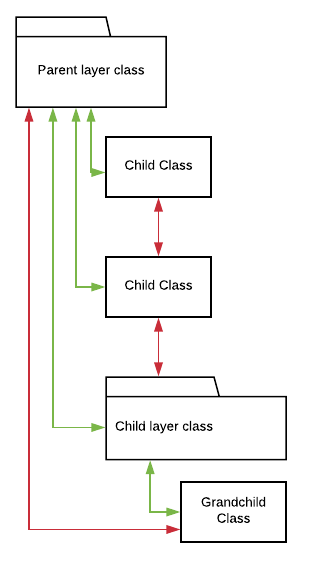
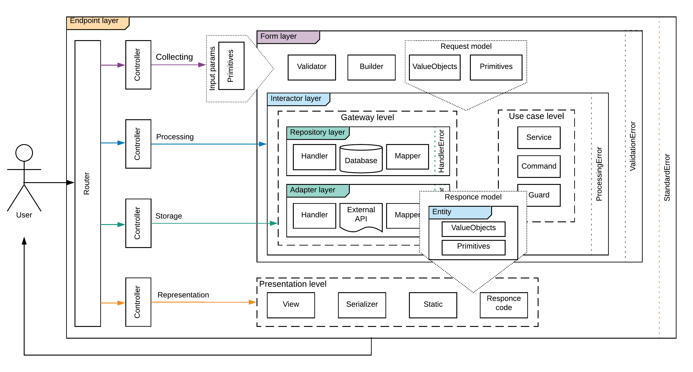

# Архитектура


# Гибкая архитектура
DDD включает в себя практику реализации через модель. Предметная область должна описываться через ваш код. Давайте попробуем разобраться, как это сделать.

В своей книге Эрик Эванс приводит ряд шаблонов проектирования, рекомендуемых к использованию, и обозначает данный подход как гибкий:

> Во имя гибкости архитектуры в программах было нагромождено множество ненужных конструкций. Лишние уровни абстрагирования и косвенных ссылок чаще мешают, чем помогают в этом деле. Посмотрите на архитектуру, которая действительно вдохновляет программистов, занимающихся ее доработкой, и вы увидите, как правило, что-нибудь очень простое. Но простое - не значит легкое в исполнении. Чтобы создать такие элементы, которые можно собрать в сложные системы и при этом нетрудно понять, необходимо сочетать "преданность " проектированию по модели с достаточно строгим стилем архитектуры. Определенный навык проектирования нужен не только для создания чего-либо, но даже для использования готового.

> Eric Evans, Domain-Driven Design: Tackling Complexity in the Heart of Software

Представленный набор шаблонов проектирования не является строгой архитектурой или готовым решением, а, скорее, пищей для размышления.

# Кричащая архитектура

Похожие мысли возникали в голове у многих разработчиков и проектировщиков сложных систем.

В 2011 году вышла статья Роберта Мартина - [Screaming Architecture](https://blog.cleancoder.com/uncle-bob/2011/09/30/Screaming-Architecture.html), которая говорит о том, что ваш код не просто должен описывать предметную область, а орать о ней, желательно матом.

> So what does the architecture of your application scream? When you look at the top level directory structure, and the source files in the highest level package; do they scream: Health Care System, or Accounting System, or Inventory Management System? Or do they scream: Rails, or Spring/Hibernate, or ASP?

> Robert C. Martin, 30 September 2011

Роберт рассказывает, что код вашего приложения должен отображать деятельность приложения, вместо того чтобы подстраиваться под правила фреймворка. Структура фреймворка не должна ограничивать вашу архитектуру. Приложение,в свою очередь, не должно привязываться к БД или http протоколу, это всего лишь механизмы хранения и доставки. Ограничительные рамки являются инструментом. Не следует становиться адептом фреймоворка. Тесты вашего приложения - это тесты логики его работы, а не тестирование http протокола.

# Чистая архитектура

Через год выходит следующая статья Роберта Мартина - [The Clean Architecture](https://blog.cleancoder.com/uncle-bob/2012/08/13/the-clean-architecture.html). В ней автор рассказывает, как добиться того, чтобы код кричал. Изучив несколько архитектур, он выделяет основные принципы:

1. Независимость от рамок. Архитектура не зависит от какой-то существующей библиотеки. Это позволяет использовать фреймворки как инструменты, а не ограничения, связывающие ваши руки.
2. Тестируемость. Бизнес-правила могут быть протестированы без пользовательского интерфейса, базы данных, веб-сервера или любого другого технического средства.
3. Независимость от пользовательского интерфейса. Пользовательский интерфейс может легко меняться, не изменяя остальную часть системы. Например, веб-интерфейс можно заменить консольным интерфейсом, не изменяя бизнес-логику.
4. Независимость от базы данных. Вы можете обменять Oracle или SQL Server на Mongo, BigTable, CouchDB или что-то еще. Логика вашего приложения не должна быть привязана к базе данных.
5. Независимость от воздействия внешней среды. На самом деле ваши бизнес-правила просто ничего не знают о внешнем мире.

На хабре уже опубликована очень хорошая статья [Заблуждения Clean Architecture](https://habr.com/company/mobileup/blog/335382/). Ее автор, @Jeevuz очень хорошо разжевал тонкости понимания данного подхода. Настоятельно рекомендую ознакомиться как и с ней так и с оригинальными материалами.

# Вариативная архитектура

Описание представленного выше подхода не выглядит столь однозначным. В рамках разработки архитектуры ряда сложных корпоративных систем мной и моими коллегами была выработана достаточно четкая интерпретация описанных подходов, которую я собираюсь изложить ниже.

До появления компьютеров и языков программирования при построении и управлении системами со сложной бизнес-логикой использовался бумажный документооборот. Результатом любого процесса являлся документ, который в конечном счете описывал тот или иной бизнес-объект. В итоге делопроизводство сводилось к трем простым _Действиям_:

1. Создание документа
2. Обработка документа
3. Работа с архивом документов
4. Представление документа

> Документ - фиксация информации о хозяйственной деятельности относительного того или иного реального бизнес-объекта.

Прошу заметить, что документ сам по себе не является реальным бизнес-объектом, а только его _Моделью_. В данный момент бумажные документы вытесняются электронными. Документом может быть запись в таблице, картинка, файл, отправленное письмо или любой другой фрагмент информации.
Я бы не хотел в дальнейшем использовать слово документ, так как оно будет вносить скорее путаницу, мы будем использовать понятие _Сущность_ (Entity) из DDD терминологии. Но вы можете представить, что сейчас вся ваша система, это система электронного документооборота, которая выполняет четыре простых _Действия_.

1. Collecting
2. Processing
3. Storage
4. Representation

> Действие (Action) - структурная единица деятельности бизнес-модели; относительно завершенный отдельный акт осознаваемой цели, произвольность и преднамеренность индивидуальной активности бизнес-объекта, различаемая конечным потребителем.

Хорошим примером _Дейсвтия_ является театральный акт. Театр моделирует события из реальной жизни. Акт является осмысленной частью пьесы. Но, чтобы сделать историю законченной, нужно проиграть несколько актов в строго отведенном порядке. Такой порядок в нашей архитектуре мы будем называть _Режим_.

> Режим (Conduction)- набор _Действий_ в определенном порядке, имеющий законченный смысл, несущий пользу конечному потребителю.



<a name="conduction" id="conduction"></a> Для подобных _Режимов_ работы был придуман селективный кондуктор или _Вариатор_ (Selector). Точнее "Timing mechanism for conducting a selected one of a plurality of sequences of operation", на который был получен патент [US2870278A](https://patents.google.com/patent/US2870278A/en). Мы знаем это устройство как "крутилка" стиральной машины. Архитектурная "крутилка" приведена в начале статьи.

Вариативность подхода проявляется в том, что с такой архитектурой вы можете выбрать любой из четырех _Режимов_, проходя которые вы не будете совершать лишних _Действий_.

Запуская стиральную машину, вы можете выбрать режим: стирка, полоскание или отжим. Если вы выбрали стирку, то ваша машина все равно прополощет белье, а затем его отожмет. С полоскание в комплекте вы обязательно получите отжим. Отжим - финальное _Действие_ в процессе стирки оно является самым “простым”. В нашей архитектуре самое простое _Дейтствие_ - _Представление_, с него и начнем.

## Представление (Representation)

Если говорить о чистом представлении без обращения к базе данных или внешнему источнику, то мы выдаем какую-то статическую информацию: html-страницу, файл, справочник лежащий в виде json'a. Мы даже можем выдать просто _Code response_ - 200:

Напишем простейший "Health checker"

```ruby
  module Health
    class Endpoints < Sinatra::Base
      get '/check' do; end
    end
  end
```

В самом примитивном виде наша схема будет выглядеть так:


<spoiler title="Лирическое отступление">
Я прошу заметить, что во фреймворке Sinatra класс _Endpoints_ объединяет в себе как _Router_, так и _Controller_ в одном классе. Не нарушает ли это принципа единственной ответственности? По факту, Endpoints это не класс, а слой, выраженный через класс, и зона его ответственности на более высоком уровне.

Ок, а как же _Router_ и _Controller_? Они представлены не набором классов, а наименованием и реализацией функции. А статический файл это вообще файл. Один класс отвечает одной ответственности, но не пытайтесь выразить каждую ответственность через класс. Исходите из практичности, а не из догматизма.
</spoiler>

## Работа с системой хранения (Storage)

Бизнес требователен к доступности вашего приложения. Зачем кому-то нужен ваш сервис, если в нужный момент мы не можем его использовать? Для обеспечения целостности данных мы фиксируем изменение состояния бизнес-объекта после каждой обработки.

Чтобы извлечь объект из хранилища, не требуется обращение к бизнес-логике. Представим, что мы автоматизируем деятельность сети отелей и у нас есть журнал постояльцев на стойке регистрации. Мы решили посмотреть информацию о посетителе.

```ruby
  module Reception
    class Endpoints < Sinatra::Base
    
    # Show item
    get '/residents/:id', provides: :json do
      resident = Repository::Residents.find params[:id]
      status 200
      serialize(resident)
    end
  end
end
```

_Работа с системой хранения_ в виде графической схемы:



Как мы можем заметить общение между уровнем, отвечающим за _Хранение_, и уровнем, отвечающим за представление данных, реализовано через Response model. Данная модель не принадлежит ни одному из этих слоев. По факту, это бизнес-объект и он находится на слое, отвечающим за бизнес-логику.

## Обработка (Processing)

Если речь заходит о том, что объектная модель изменяется на основе своих свойств без внесения новых данных, то мы обращаемся к слою _Интерактора_ напрямую. Слой _Интерактора_ является ключевым в нашем приложении, именно в нем описывается вся бизнес-логика в виде отдельных _Вариантов использования_ (Use Cases) и именно на нем идет изменение _Сущностей_.

Рассмотрим такой сценарий использования. В нашей гостинице посетитель уже зарегистрирован, но мы отмечаем каждый его приход или уход.

```ruby
  module Reception
    class Endpoints < Sinatra::Base
      
      # Register resident arrival
      post '/residents/:uid/arrival', provides: :json do
        result = Interactors::Arrival.call(resident_id: params[:id])
        check!(result) do
          status 201
          serialize result.data
        end
      end

      # Register resident departure
      post '/residents/:uid/departure', provides: :json do
        result = Interactors::Departure.call(resident_id: params[:id])
        check!(result) do
          status 201
          serialize result.data
        end
      end
    end
  end
```

Давайте немного остановимся. Почему не сделать реализацию одним методом с параметром `status` ? _Интеракторы_ `Arrival` и `Departure` в корне отличаются. Если к нам пришел постоялец, то мы должны проверить закончилась ли уборка, не поступало ли для него новых сообщений и т.п. При его уходе мы, наоборот, должны инициировать уборку в случае необходимости. Про сообщения, в свою очередь, мы даже не вспоминаем, поскольку если бы он был в гостинице, мы бы ему сразу позвонили. Именно всю эту логику бизнеса мы и прописываем на слое _Интерактора_.



Но что нам делать, если у нас есть данные извне? Тут подключается действие _Сбора данных_.

## Сбор данных (Collecting)

При первичной регистрации постояльца в гостинице он заполняет форму регистрации. Эта форма проверяется. Если данные верны, то происходит бизнес-процесс Регистрация. Процесс возвращает данные - созданную бизнес-модель "Постояльца". Эту модель мы представляем постояльцу в читаемой форме:

```ruby
module Reception
  class Endpoints < Sinatra::Base

  # Register new resident
    post '/residents', provides: [:json] do
      form = Forms::Registration.new(params)
      complete! form do
        check! form.result do
          status 201
          serialize form.result.data
        end
      end
    end
  end
end
```

Схематично это выглядит так:



# Правила игры (Rules)

- Вариативная система с точки зрения процессов делится на _Действия_.
- Последовательность _Действий_ определяется _Режимом_.
- _Режимы_ инкрементальны.
- Более "сложный" _Режим_ дополняет более "простой", на строго одно действие.
- Каждое действие происходит в рамках одного _Слоя_.
- Каждый слой представлен _Классом_.
- Внутри слоя могут быть _Классы-Слои_ и _Классы-Ответственности_.
- Общение происходит только между _Слоем_ и _Внутрислойным Классом_.
- _Модели-Представления_ являются исключениями.
- Обработка ошибок должна происходить на уровне _Класса-Cлоя_.



# Общая схема

У данного подхода высокий порог вхождения. Его применение требует от проектировщика большого опыта для четкого осознания решаемых задач. Сложность также представляет разнообразие выбора необходимого инструмента. Но, не смотря на сложность структуры, реализация на уровне кода невероятно проста и выразительна. Хотя и содержит в себе ряд условностей и доверенностей. В дальнейшем мы разберем каждый шаблон проектирования в отдельности, опишем как его создать, тестировать и обозначим область применения. А чтобы не запутаться в их многообразии, предлагается полная карта:


---
- Проблемно-ориентированное проектирование, Эрик Дж. Эванс
- Кейт Матсудейра: Масштабируемая веб-архитектура и распределенные системы
- https://blog.cleancoder.com/uncle-bob/2012/08/13/the-clean-architecture.html
- https://blog.cleancoder.com/uncle-bob/2011/09/30/Screaming-Architecture.html
- https://habr.com/company/mobileup/blog/335382/